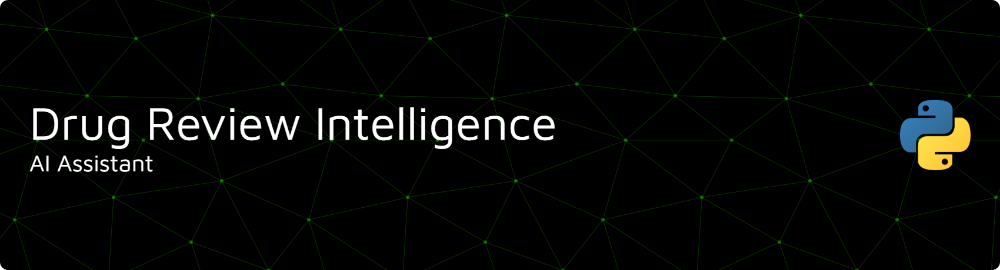

An interactive **Streamlit web app** and **CLI assistant** that answers questions about **drug reviews**.

## 🎥 Project Demo

<div align="center">
  <a href="https://youtu.be/gl_JrtfQEz8">
    
  </a>
  <p><i>Click the image above to watch the demo</i></p>
</div>

---

## 📖 Overview

This project implements a local AI agent capable of answering questions based on medical data using:

- A **RAG (Retrieval-Augmented Generation) pipeline** over a local ChromaDB vector store built from `drugsComTest_raw.csv`.
- A set of **tool-calling agents** for:
  - 📷 **OCR** on uploaded medicine images (EasyOCR)
  - 🔍 **Searching reviews** and side effects (RAG over ChromaDB)
  - 📊 **Basic analytics** like average rating, review counts, and Top-5 lists (Pandas)
- A local **Ollama** LLM (e.g., `gemma3:4b`) and **HuggingFace** sentence embeddings.

You can interact with the project via:
- `app.py` → **Streamlit UI** (Recommended for demos)
- `main.py` → **Backend / CLI assistant** (For debugging/experimentation)

---

## 🚀 Running the Project

Follow these steps to set up the environment and launch the AI Assistant.

### 1. Prerequisites
Ensure you have **Python 3.10+** installed. You will also need **Ollama** running locally for the LLM.

1.  Download and install [Ollama](https://ollama.com/).
2.  Pull the specific model used in this project (as per `main.py`):
    ```bash
    ollama pull gemma3:4b
    ```
    *(Note: If you wish to use a different model, update the model name in `main.py`)*.

### 2. Installation

Clone the repository and install the dependencies:

```bash
# 1. Clone the repository
git clone [[https://github.com/yourusername/drug-review-intelligence.git](https://github.com/yourusername/drug-review-intelligence.git)](https://github.com/tmphan66/drug-review-intelligence.git)
cd drug-review-intelligence

# 2. Create a virtual environment (Recommended)
python -m venv venv

# 3. Activate the environment
# On Windows:
.\venv\Scripts\activate
# On Mac/Linux:
source venv/bin/activate

# 4. Install requirements
pip install -r requirements.txt
```
### 3. Run the Project

Run the project with Streamlit UI (Recommended)

```bash
streamlit run app.py
```

OR you can run the project in CLI Mode (For Debugging)

```bash
python main.py
```

---

## 📂 Project Structure

```text
.
├─ asset/
│  └─ demo_video.mp4                # Demo assets
├─ data   
│  └─ drugs_cleaned.csv             # Dataset of drug reviews
├─ video/                           
│  └─ demo_video.mp4
├─ drugs_data_preprocessing.ipynb   # Backend logic, tools, RAG, OCR, and CLI
├─ app.py                           # Streamlit web application (UI and glue)
├─ main.py                          # Backend logic, tools, RAG, OCR, and CLI
├─ chroma_db/                       # ChromaDB collection (auto-created on first run)
├─ requirements.txt                 # Python dependencies
└─ README.md                        # This file

